<h1 align="center">Logic Apps Workflow Visualizer</h1>

<p align="center">
  A Chromium browser extension that renders <b>Azure Logic App workflows</b> as an interactive
  graph <b>inside Azure DevOps</b> — on file view and in pull requests, with a before/after
  graph diff for reviews.
</p>

<p align="center">
  
  
  
  
  
  <a href="LICENSE"></a>
</p>

Reviewing Logic App workflows as raw JSON — especially in an Azure DevOps pull request — is
painful. This extension detects Logic App workflow definitions on Azure DevOps pages and draws
them as a nested, auto-laid-out diagram styled after the Azure Logic Apps designer, so you can
reason about the workflow instead of the JSON.

Everything runs client-side in your browser. No backend, no Personal Access Token, nothing
sent to any third party.

<p align="center">
  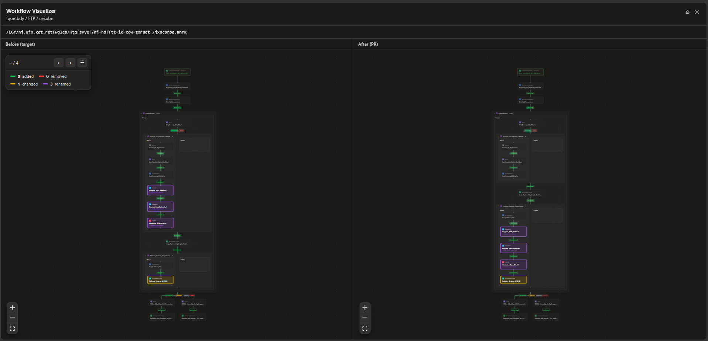<br>
  <em>A workflow change reviewed as a before/after graph diff inside an Azure DevOps pull request.</em>
</p>

> The screenshots below are captured with the **Scramble names & paths** developer setting on,
> so the org/project/repo, file paths, and node names are masked — the layout and behavior are
> real.

## Table of contents

- [Why this exists](#why-this-exists)
- [Features](#features)
- [Screenshots](#screenshots)
- [Quick start (dev harness)](#quick-start-dev-harness)
- [Install the extension](#install-the-extension)
- [Settings](#settings)
- [How it works](#how-it-works)
- [Architecture](#architecture)
- [Workflow model](#workflow-model)
- [Design decisions](#design-decisions)
- [Project structure](#project-structure)
- [Scripts](#scripts)
- [Testing](#testing)
- [Roadmap](#roadmap)
- [Contributing](#contributing)
- [License](#license)
- [Acknowledgements](#acknowledgements)

## Why this exists

Low-code integration workflows like Azure Logic Apps are authored visually but **stored and
version-controlled as JSON**. In Azure DevOps that JSON is what you review: a pull request on a
workflow is a wall of nested `actions`, `runAfter` maps, and expression strings. Even a small
change — a re-routed dependency, a flipped condition, a moved action — is hard to spot in the
diff, and the shape of the workflow (the thing that actually matters) is invisible. Reviewers
end up mentally re-drawing the graph in their heads, or opening the designer in a separate
Azure portal tab and eyeballing the two versions. This tool puts that graph — and a real
before/after diff of it — right where the review happens.

**Why now: the nature of the job is shifting toward review.** AI coding assistants are changing
how software gets built. More and more of the first draft — code, configuration, and integration
workflows alike — is generated by tools rather than typed by hand. That doesn't remove the
engineer from the loop; it moves them. The bottleneck is shifting from *writing* to
**reading, reviewing, and verifying** — understanding change that someone (or something) else
produced, and deciding whether it's correct and safe to ship. As the volume of machine-generated
change grows, engineers will spend a far larger share of their time reviewing than authoring.

Review only scales if you can review at the right level of abstraction. Reading a generated
workflow line-by-line as JSON is exactly the wrong level — it's slow, error-prone, and doesn't
match how anyone reasons about an integration. A visual, diff-aware view lets a reviewer grasp
*what changed structurally* in seconds: which actions were added or removed, which dependencies
were rerouted, whether a rename is just a rename or a rename **plus** a behavior change. That is
the gap this visualizer is built to close — making workflow review fast and trustworthy in the
era where reviewing is most of the work.

## Features

- **Workflow graph.** Parses Workflow Definition Language (WDL) JSON and draws triggers,
  actions, and control-flow scopes (`If`, `Switch`, `Foreach`, `Until`, `Scope`) as a nested,
  hierarchical diagram.
- **Lives inside Azure DevOps.** A **⬡ Visualize** button appears in ADO's own toolbar when the
  open file is a workflow it can render — on a file view, a pull request, a single commit, and
  the create-pull-request page.
- **No token setup.** Reuses the Azure DevOps web app's own **Bearer token** (captured
  read-only) to fetch the file from the REST API, so it just works while you're signed in.
- **Before/after diff.** On a pull request — or a single commit (diffed against its parent) —
  the panel shows the workflow side-by-side
  (before | after) with nodes colored by change (added / removed / changed / renamed) and a
  per-node JSON diff on click. Changes stay visible when zoomed out (fill tint + gutter stripe),
  the two panes **sync pan/zoom**, and a floating **Changes** window steps through each change.
- **Rename/move detection.** A renamed or moved action is matched to its counterpart (by type
  + body similarity) instead of showing as a separate remove + add — and is still flagged
  changed if its body also differs.
- **Status-colored edges.** Paths are colored by run-after status (green = Succeeded,
  yellow = TimedOut, gray = Skipped, red = Failed), solid for success and dotted otherwise,
  with segmented edges and chips when a dependency has multiple statuses.
- **Node inspector.** Click a node for its definition (a designer-style **Fields** view with a
  Raw JSON fallback) and its **Runs after** dependencies with colored status dots.
- **Export & import for support.** Export the open workflow (or a PR's before/after pair) to a
  JSON file — **scrambled by default** so you can attach it to a public GitHub issue without
  leaking private data, yet it still reproduces the same graph. Re-open any export (or paste raw
  workflow JSON) from the **step-by-step Import** wizard — in the dev harness or the extension's
  options page.
- **Theme-aware.** Follows the Azure DevOps light/dark theme automatically, or force a theme.

## Screenshots

Impressions of the extension running inside Azure DevOps (names/paths scrambled for the shots).

**The ⬡ Visualize button** appears in Azure DevOps's own toolbar when a workflow file is open
— here on a pull request, next to the diff view-mode split button.

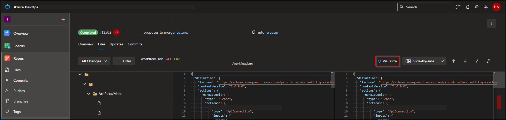

**A workflow file, visualized.** The **⬡ Visualize** button opens the panel over the page; the
graph shows triggers, actions, and nested scopes.

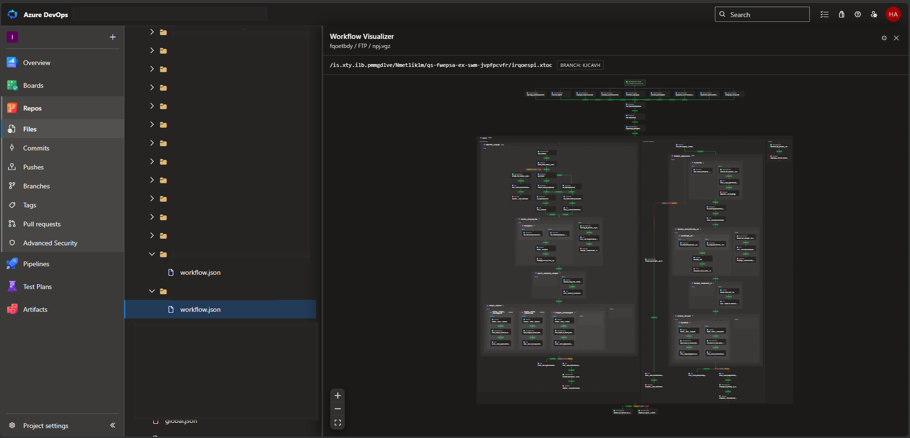

**Pull-request diff, with a node inspected.** Clicking a changed node opens its definition
(designer-style **Fields** view) with a per-field before/after diff; the **Changes** window (top
left) steps through every add / remove / change / rename.

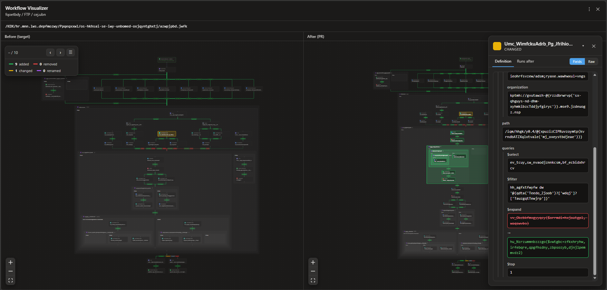

**Options page.** Theme, per-surface panel sizing, and the developer settings (selector
overrides + the scramble toggle).

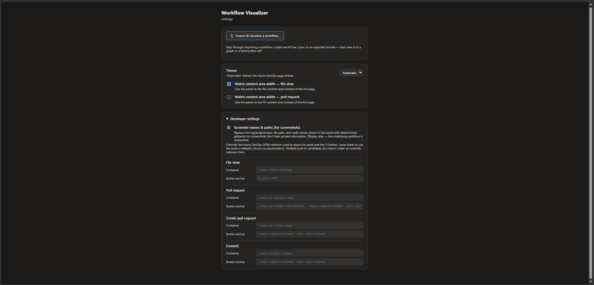

## Quick start (dev harness)

The graph renderer is a standalone React app you can run without Azure DevOps or auth — the
fastest way to see it and to iterate on the visualization.

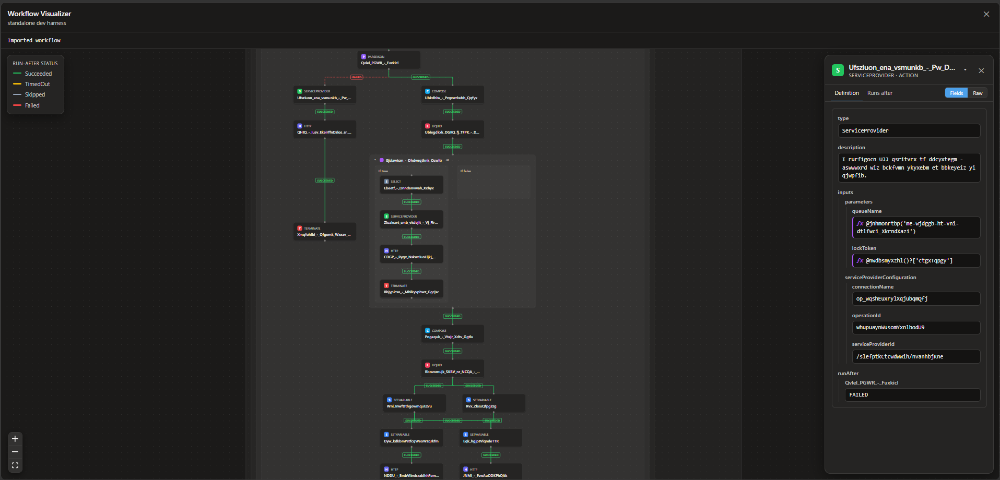

```bash
npm install
npm run dev          # empty harness — Import a workflow to begin
npm run dev:sample   # same, but the sample workflows are available too
```

The harness opens empty with an **Import** call-to-action. `npm run dev:sample` additionally
exposes the bundled sample workflows (a picker in the header and buttons on the empty screen).

**⬆ Import** opens a guided wizard — **Type → Source → Input** — that accepts a pasted workflow, a
plain `workflow.json`, or an `export.json` from this extension, and renders either a single graph
or a before/after diff. The same wizard runs on the extension's **options page** (Import &
visualize); it's walked through step by step, with screenshots, under
[Export & import](#export--import-support-cases).

## Install the extension

Build the extension and load it unpacked into a Chromium-based browser (Microsoft Edge, Google
Chrome, Brave, …).

**Prerequisites:** Node.js 18+ and npm; a Chromium-based browser.

### 1. Build

```bash
npm install
npm run build:ext
```

This type-checks and builds the unpacked extension into **`dist/extension/`** — the folder you
load next. It contains the generated `manifest.json`, the content script, and the background
service worker.

### 2. Load it (unpacked)

| Browser | Extensions page | **Developer mode** toggle |
| --- | --- | --- |
| **Microsoft Edge** | `edge://extensions` | bottom-left of the sidebar |
| **Chrome / other Chromium** | `chrome://extensions` | top-right of the page |

**a. Enable Developer mode.** Open your browser's extensions page and turn **Developer mode**
on. The **Developer options** row — **Load unpacked** / **Pack extension** / **Update** — only
appears once it is enabled.

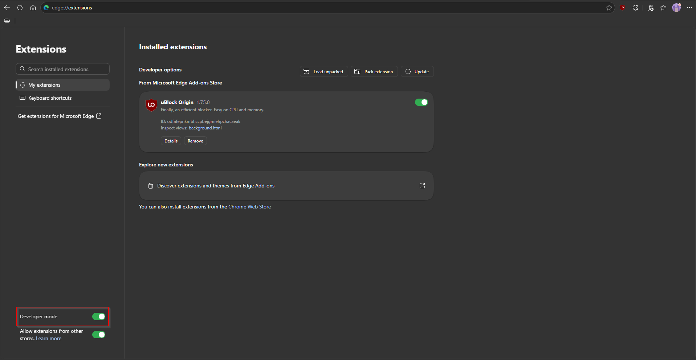

**b. Load unpacked → `dist/extension/`.** Click **Load unpacked** and pick the
**`dist/extension/`** folder produced by the build — not `dist/` itself, and not a folder inside
it. You're in the right place when the folder listing shows `.vite/`, `assets/`, and `src/`.

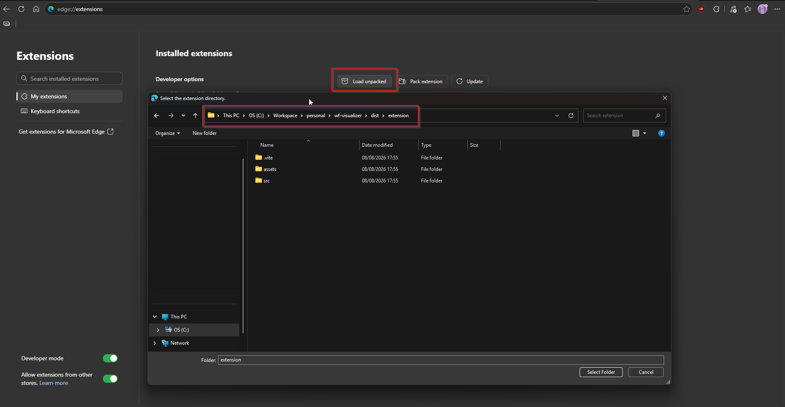

The extension **"Logic Apps Workflow Visualizer"** now appears in the list.

### 3. Use it

1. Open a workflow file in Azure DevOps, e.g.
   `https://dev.azure.com/{org}/{project}/_git/{repo}?path=/path/to/workflow.json`, or open a
   pull request / commit / create-PR page that touches a workflow file.
2. If the open file is a Logic App workflow, a **⬡ Visualize** button appears in ADO's toolbar —
   next to **Edit** on a file view; next to the vote / diff view-mode split button on a pull
   request, commit, or create-PR page. On those compare views the button only shows while a
   workflow file is open (read live from the compare toolbar).
3. Click it. On a file view it renders the workflow graph filling the page; on a pull request or
   commit it renders a **before/after side-by-side diff** of the open workflow file. The diagram centers on
   open.

> The button only appears when the open file fetches and validates as a Logic App workflow;
> other Azure DevOps pages inject nothing.

### Export & import (support cases)

When a workflow renders wrong and you want to report it, you usually **can't share the file** —
it's private. Export/import is built to close that gap without leaking anything:

- **Export** — the panel header has a **⬇** button. It opens a dialog with a **Scramble names &
  values** checkbox (**on by default**) and saves a JSON file to your machine. Scrambling
  replaces every name and string value with deterministic gibberish while **preserving the graph
  structure** (node types, containers, `runAfter` topology and statuses) — so the exported file
  reproduces the exact same diagram without exposing org/repo names, paths, URLs, or expressions.
  On a pull request it exports the **before/after** pair; on a file view, the single workflow.
- **Import** — a guided **⬆ Import** wizard that turns any of those inputs back into a graph. It's
  available in the **dev harness** (`npm run dev`) and from the extension's **options page**
  (**Import & visualize**).

#### The import wizard, step by step

The importer is a three-step wizard — **Type → Source → Input** — and it **branches on your
answers**, so the final step asks for *exactly* the inputs your case needs: no stray textareas, no
guessing which file is "before". You can step **Back** at any stage, and close and re-enter it.

**1. Type — what do you want to import?** One **Single workflow**, or a **Before & after (PR)**
pair to diff. This is what decides whether you end up with a single graph or a side-by-side diff.

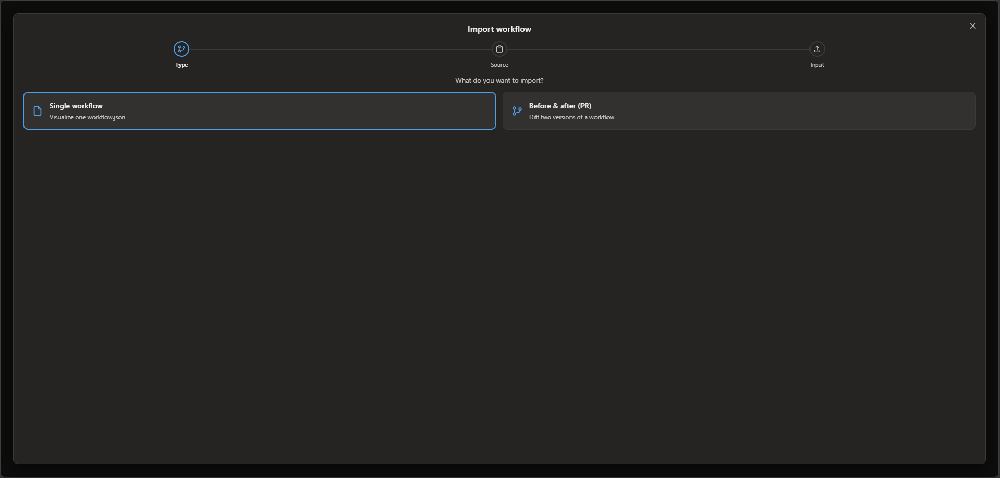

**2. Source — where is the data coming from?** **Paste JSON** (copy the workflow text), **Upload
workflow** (a plain `workflow.json` straight from the repo), or **Upload export** (an `export.json`
this extension produced). This decides how the last step collects and validates your input.

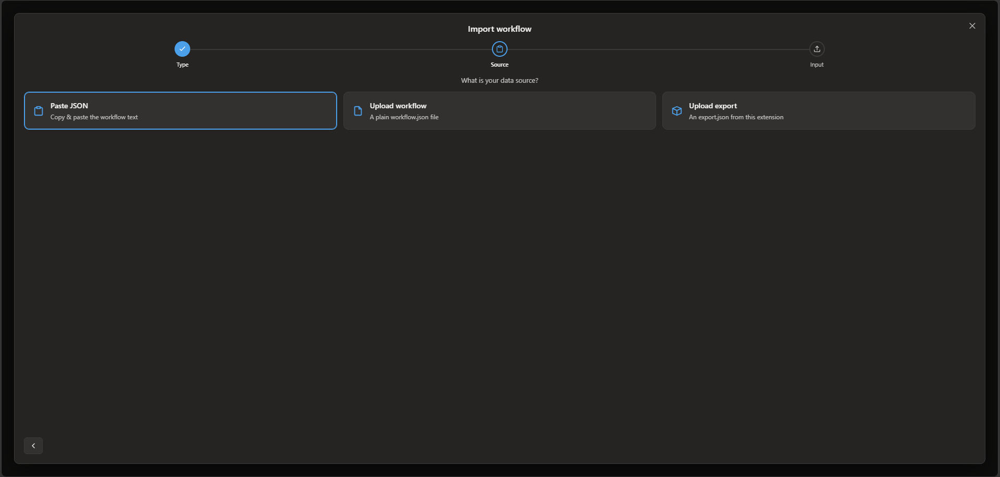

**3. Input — hand it over.** A textarea for *Paste JSON*, otherwise a drag-and-drop-or-click file
zone. The combinations are what make it feel effortless:

- **Upload export** → always a **single** drop zone, even for a PR — an export already carries both
  the before *and* after sides, so you never hunt for two files.
- **PR + Paste JSON / Upload workflow** → **two** inputs (before | after), side by side.
- Every file is validated against the chosen source: an `export.json` dropped where a plain
  workflow is expected is **auto-detected** and accepted, while an export of the *wrong type*
  (a single export dropped into a PR slot, say) is rejected with a clear message.

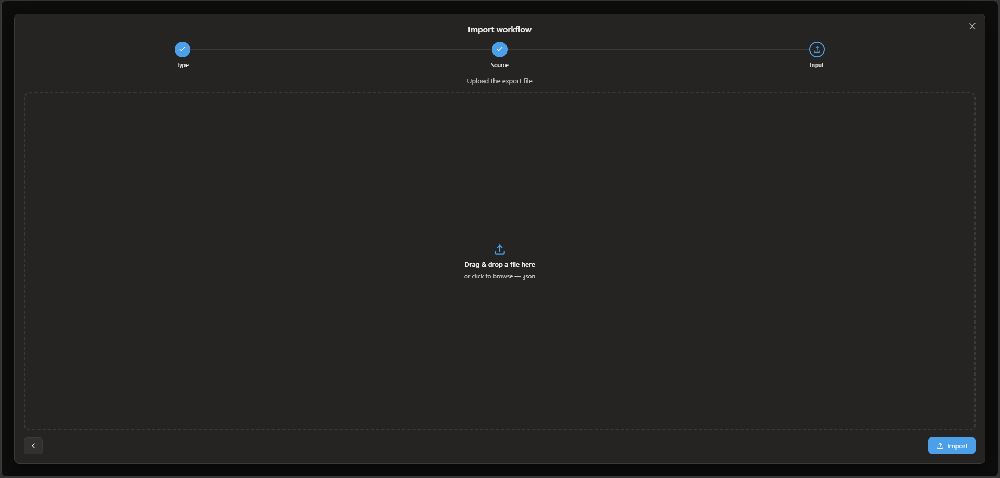

**Why a wizard, and why this order.** Import has to accept three quite different inputs (a raw
paste, a repo `workflow.json`, a scrambled export bundle) in two shapes (single vs. before/after) —
one flat form for all of that would be a wall of half-relevant fields. Asking **what → source**
first lets the last step render only the controls that apply and validate against the exact thing
you said you'd provide. That keeps the **support loop** honest end to end:

> hit a visualization bug → **Export** (scrambled) from the panel → attach the JSON to a GitHub
> issue → a maintainer **Imports** it (harness or options page) → the *same* graph reproduces, with
> no private data ever leaving the reporter's machine.

### Development mode (auto-rebuild)

```bash
npm run dev:ext
```

Writes to `dist/extension/` and rebuilds on change (crxjs HMR). Load `dist/extension/` once;
most edits hot-reload. After changing `manifest.config.ts`, the background worker, or the
content-script entry, click the **reload** ↻ icon on the extension's card and refresh the ADO
tab.

### Packaging

Zip the **contents** of `dist/extension/` for someone else to **Load unpacked**:

```bash
cd dist/extension && zip -r ../../wf-visualizer-extension.zip . && cd ../..
```

Publishing to the Edge Add-ons / Chrome Web Store hasn't happened yet — see [Roadmap](#roadmap).

## Settings

Open the extension's options page (extensions page → Details → Extension options, or the ⚙
button in the panel header):

| Setting | Description | Default |
| --- | --- | --- |
| **Match content area width — file view** | Size the panel to the file content area (`.repos-files-hub-page`) instead of filling the whole page. | On |
| **Match content area width — pull request** | Size the panel to the PR content area (`.repos-pr-details-page`) instead of filling the whole page. | Off |
| **Theme** | Automatic / Light / Dark. **Automatic** follows the Azure DevOps page theme. | Automatic |
| **Developer → Scramble names & paths** | Mask the org/project/repo, file path, and node names shown in the panel with deterministic gibberish (structure preserved), so screenshots don't leak private information. Display-only. | Off |
| **Developer → Selector overrides** | Override the Azure DevOps DOM selectors (panel container and ⬡ button anchor) per surface, for when ADO changes its markup. Blank uses the built-in defaults. | Built-in |

### Permissions requested

Declared in [manifest.config.ts](manifest.config.ts):

| Permission | Why |
| --- | --- |
| `host_permissions: dev.azure.com`, `*.visualstudio.com` | Run the content script and fetch the open file from the Azure DevOps REST API. |
| `webRequest` | Read the `Authorization: Bearer` header from the ADO web app's own API calls, so the extension can fetch the file as you (no PAT). Scoped to Azure DevOps hosts. |
| `storage` | Cache the captured token in `chrome.storage.session` (in-memory, cleared on browser close) and persist settings in `chrome.storage.sync`. |

The extension only reads the workflow file you're viewing, using the token your browser already
holds for Azure DevOps. **The token stays in your browser and nothing is sent to any third
party.**

## How it works

```
Logic App JSON ──▶ parser ──▶ graph model ──▶ layout ──▶ React Flow
```

- **Parser** — [src/parser/parseWorkflow.ts](src/parser/parseWorkflow.ts). Locates the workflow
  definition (bare, `{definition}`, or `{properties.definition}`), then turns triggers and
  actions into a graph. `runAfter` relationships become edges; control-flow scopes become nested
  branches. Pure functions — no browser dependency.
- **Layout** — [src/graph/layout.ts](src/graph/layout.ts). Recursive
  [Dagre](https://github.com/dagrejs/dagre) layout. Each scope is laid out independently;
  container sizes derive from their contents, and nodes are ordered so parents precede children
  (a React Flow subflow requirement).
- **Rendering** — [src/graph/](src/graph/). [React Flow](https://reactflow.dev)
  (`@xyflow/react`) with custom trigger / action / scope / branch nodes, styled after the Azure
  Logic Apps designer.
- **Dev harness** — [src/App.tsx](src/App.tsx). A sidebar of sample workflows plus a
  live-editable JSON editor.

## Architecture

The extension is a Manifest V3 add-on with three parts:

- **Content script** — injected into `dev.azure.com`. Detects the current surface
  (file / pull request / commit / create-PR), extracts context (org / project / repo / path / commit or
  PR id) from the URL ([adoContext.ts](src/extension/adoContext.ts)), and mounts the UI. It does
  **not** scrape the Monaco editor (it virtualizes rows, so the full file isn't in the DOM).
- **Background service worker** — performs the REST fetches, captures and caches the ADO Bearer
  token, and resolves PR diff versions ([background.ts](src/extension/background.ts),
  [adoApi.ts](src/extension/adoApi.ts)).
- **UI (React app)** — the graph panel, mounted inside a **shadow root** so Azure DevOps styles
  and ours stay isolated (React Flow + our CSS are injected as strings).

**Data fetch.** The worker observes the ADO web app's `_apis` traffic via read-only
`webRequest`, caches the `Authorization: Bearer` token, and reuses it to call the REST "Get
Item" API (`includeContent=true`), unwrapping the `content` field. If no token has been captured
yet it briefly retries, then falls back to a first-party session-cookie fetch. The button shows
only if the content validates as a Logic App workflow
([detectWorkflow.ts](src/extension/detectWorkflow.ts)).

**Diff.** On a pull request the worker resolves the two versions to diff — the PR's merge
commits (`lastMergeTargetCommit` = before, `lastMergeSourceCommit` = after) on an existing PR,
the source vs. target branch refs on a create-PR page, or a commit's first parent vs. the commit
itself on a single-commit view — fetches each side, and the panel renders the before/after graph
diff.

**Navigation signal + branch.** The same `webRequest` listener sees ADO fetch a `workflow.json`
(an `includeContent` items request, issued even on soft navigation) and nudges the panel to
reload with that file. It also remembers that request's **version descriptor** (the
branch/commit ADO itself used, `parseVersionDescriptor`) per tab — the authoritative branch for
a file view. Re-issuing the captured URL is branch-correct by construction, and when the panel
has to reconstruct the fetch it pins to that ref (falling back to the page URL's `&version=`),
so a workflow that exists **only on a feature branch** resolves instead of 404-ing against the
default branch. The content script also polls `location.href` (an isolated-world content script
can't intercept the page's `history.pushState`), so switching workflows without a page reload
updates the panel.

**In-page placement.** The button is a React portal into ADO's own toolbar — before the **Edit**
button (`#__bolt-edit`) on a file view, before the vote button / compare-toolbar split button on
a PR, commit, or create-PR page — kept alive across ADO re-renders by a `MutationObserver`. On
those compare views it is gated on an open workflow file, read live from the compare toolbar's
path, so switching to a non-workflow file hides it. If the toolbar anchor can't be found, nothing
is injected. The per-surface selectors live in [src/config.ts](src/config.ts) and are checked
against per-surface DOM stubs in [surfaceSelectors.test.ts](src/extension/surfaceSelectors.test.ts).

> **Why fetch instead of scrape?** ADO renders files in a Monaco editor that virtualizes rows —
> only the visible lines exist in the DOM — so the full file can't be read from the page. The
> same-origin REST call returns the complete file with no extra auth.

## Workflow model

**Parsing (WDL → graph).** Triggers become entry nodes; actions become nodes carrying `type`,
`inputs`, and `runAfter`; `runAfter` becomes the primary (dependency) edges; and control-flow
scopes (`If`, `Switch`, `Foreach`, `Until`, `Scope`) become container nodes with nested
subgraphs.

**Diffing.** The diff runs on the **parsed graphs**, not the JSON text
([diff.ts](src/graph/diff.ts)). Nodes flatten across scopes and match first by id
(scope-path + name), then remaining add/remove candidates of the **same type** are matched as
**renames/moves** by body similarity (normalized-JSON ratio, threshold 0.5; a matching name
boosts the score). Each node is classified:

| Class | Meaning | Color |
| --- | --- | --- |
| **added** | in the after version only | green |
| **removed** | in the before version only | red |
| **changed** | in both, normalized JSON differs | amber |
| **unchanged** | in both, identical | dimmed |
| **renamed** | matched across a rename/move (still flagged changed if the body differs) | — |

The node "body" used for comparison excludes `runAfter` (an edge concern) and, for containers,
the nested actions (they are separate nodes).

## Design decisions

<details>
<summary><b>Host: a Chromium extension, not a native ADO Marketplace extension</b></summary>

Chosen for per-user install without org admin approval. The accepted trade-off is fragility of
DOM/auth on the Azure DevOps SPA — mitigated by centralizing the selectors (see below) and
allowing per-surface overrides.
</details>

<details>
<summary><b>Data acquisition: fetch, don't scrape</b></summary>

DOM scraping of the file view is not viable: Azure DevOps renders files in a Monaco editor that
virtualizes rows, so only the ~visible lines exist in the DOM (verified against a saved real
page — the full workflow JSON was absent; only page metadata like `commitId`/`objectId` is
embedded). The extension fetches the open file's raw content from the same-origin ADO REST "Get
Item" API in the background worker, and only shows the button when the fetched file validates as
a Logic App workflow.
</details>

<details>
<summary><b>Auth: capture the ADO web app's own Bearer token</b></summary>

Rather than a Personal Access Token, the background worker observes ADO's `_apis` requests via
read-only `webRequest` (`onBeforeSendHeaders`, `extraHeaders`), caches the latest
`Authorization: Bearer …` per host in `chrome.storage.session`, and reuses it to fetch the file.
No user setup while signed in. Auth order: **captured Bearer → session-cookie fallback → (PAT
deferred)**. Token expiry is handled by always using the most recent captured token and dropping
it on 401. Cost: the `webRequest` permission (the install prompt mentions reading browsing
activity on dev.azure.com).
</details>

<details>
<summary><b>Rendering: a shadow-root panel over an iframe</b></summary>

A shadow root isolates styles both ways (React Flow + our CSS injected as strings) while letting
the content script reuse the visualizer components directly — no postMessage plumbing and no
web-accessible HTML page.
</details>

<details>
<summary><b>PR diff: side-by-side, read at any zoom</b></summary>

Presentation is two panes, each with its own collapse, with **synced pan/zoom** (a user move on
one propagates to the other via a `ReactFlowInstance` ref, guarded by an active-pane flag).
Changes read at any zoom level via a fill tint + bold left gutter stripe + border (not just a
thin border), and unchanged nodes dim. A floating **Changes**
window shows per-status counts, a prev/next stepper, and an expandable list; jumping `fitView`s
both panes to the change, pulses it, and opens its scoped JSON line diff. Deferred: a unified
overlay diff, a multi-file picker, and edge-level diff coloring.
</details>

<details>
<summary><b>Anti-flicker on SPA navigation</b></summary>

Navigating workflow → workflow briefly cycles the load state (`ready → loading → ready`) and
re-renders ADO's toolbar. To keep the button from blinking: (a) the last-loaded workflow stays
"shown" through brief reloads and only hides after not-ready persists ~500 ms, and (b) the
toolbar mount is a single persistent element that is *relocated* before the new anchor rather
than recreated.
</details>

<details>
<summary><b>Theming</b></summary>

Theme is `auto | light | dark`, default auto. Auto detection
([adoTheme.ts](src/extension/adoTheme.ts)) checks ADO theme classes (`vss-theme-dark`, …), then
falls back to the page background luminance (robust to class-name changes), then OS preference.
The resolved theme is stamped as `data-theme` on the shadow-root wrapper; nearly all colors are
CSS variables whose palette tracks the **actual Azure DevOps neutral themes** (Fluent) — a
neutral dark on `:host` and a neutral light on `[data-theme='light']` in
[panel.css](src/extension/panel.css) (mirrored for the harness in
[styles.css](src/styles.css)) — so the panel reads as native to the page. React Flow prop-only
colors (canvas background, dots) switch via a small per-theme palette in
[WorkflowGraph.tsx](src/graph/WorkflowGraph.tsx).
</details>

<details>
<summary><b>Configuration surface</b></summary>

Fragile / likely-to-change coupling is centralized in [src/config.ts](src/config.ts) so behavior
can change without deep code edits:

- **ADO DOM selectors** — `ADO_SURFACE_UI` containers and toolbar anchors, plus
  `ADO_COMPARE_PATH_SELECTOR`. Selectors are **candidate lists** (tried in order) covering UI
  variants — a PR shows a vote button (active) *or* the compare-toolbar split button (completed)
  — and each is **overridable per surface** via the options page's Developer settings.
- **REST** — `ADO_API_VERSION` (7.1) and the `_apis` capture patterns.
- **Tunables** — rename similarity threshold, Fields depth / long-text / expression settings, and
  timings (fetch warm-up, hide debounce, pane-sync enable, jump animation).

Layout constants ([layout.ts](src/graph/layout.ts)) and palettes
([palette.ts](src/graph/palette.ts)) stay in their own cohesive modules; message-type strings,
the internal node-id scheme, and the permission list are intentionally hardcoded.
</details>

## Project structure

```
src/
  parser/        WDL → graph model (pure functions, + tests)
  graph/         Dagre layout, React Flow nodes, diff, palette, inspector
  extension/     content script, background worker, ADO context/API, panel UI, options
  harness/       sample-workflow list for the dev harness
  config.ts      central ADO selectors + tunables
  App.tsx        dev-harness UI
  main.tsx       harness entry point
  styles.css     shared node/graph styling
tests/
  data/          sample workflows + HTML fixtures
    html/stubs/    minimal per-surface DOM stubs (selector tests)
  e2e/           Playwright specs + fixtures
  test-results/  Playwright output (gitignored)
manifest.config.ts        MV3 manifest (crxjs)
vite.config.ts            harness build  → dist/graph
vite.config.extension.ts  extension build → dist/extension
```

The harness (the "graph" app) and the browser extension are two separate applications; each
builds into its own subfolder of `dist/` (`dist/graph` and `dist/extension`). Only workflows
imported by [src/harness/fixtures.ts](src/harness/fixtures.ts) are bundled into the harness; the
remaining fixtures in `tests/data/` are used solely by the test suite and never ship.

## Scripts

| Script | Description |
| --- | --- |
| `npm run dev` | Start the harness Vite dev server (hot reload), empty (Import or paste). |
| `npm run dev:sample` | Same, but preloads the bundled sample workflows in the sidebar. |
| `npm run build` | Type-check + build the standalone harness into `dist/graph`. |
| `npm run preview` | Preview the harness production build. |
| `npm run dev:ext` | Start the extension dev build (crxjs, HMR) into `dist/extension`. |
| `npm run build:ext` | Type-check + build the extension into `dist/extension`. |
| `npm test` | Run the Vitest unit suite (parser, layout, palette, ADO context/API). |
| `npm run test:watch` | Run unit tests in watch mode. |
| `npm run test:e2e` | Build the extension and run the Playwright e2e checks. |
| `npm run typecheck` | Type-check only. |

## Testing

- **Unit (Vitest)** — the pure WDL→graph logic (trigger detection, `runAfter` edges, nested
  scopes, malformed input), the diff, palettes, and ADO context/API helpers. Most logic — and
  most bugs — live here. The per-surface DOM selectors are also verified against per-surface
  stubs in [tests/data/html/stubs/](tests/data/html/stubs/) — minimal, faithful copies of each
  ADO surface's container + toolbar anchor, parsed (via cheerio) to assert each surface's
  container and toolbar anchor resolve — so a config selector that stops matching (the failure
  mode that silently hides the ⬡ button) fails a test.
- **End-to-end (Playwright)** — `npm run test:e2e` builds the extension, loads it into a real
  Chromium, and drives it. Because the tests can't reach real Azure DevOps (auth), they intercept
  the page navigation and the `_apis/git/.../items` fetch, fulfilling the latter with a sample
  workflow — so the browser commits a document at a matching URL and the extension runs its real
  fetch-and-validate path against stubbed responses. The checks cover: the worker loads; the
  button appears and the graph renders inside the shadow root for a valid workflow; the workflow
  is fetched with the captured Bearer token; the button stays hidden for non-workflows, on 401,
  and when no workflow is open; a before/after diff renders on a PR and on a single commit; and
  collapsing a scope hides nested nodes.

> The Bearer test seeds a token into the worker's `storage.session` directly, because Playwright's
> request interception bypasses the `webRequest` layer — so the capture itself is verified
> manually against real ADO, while the fetch-with-token path is covered here.

Chrome extensions need a headed context; the fixture uses the new headless mode
(`--headless=new`, no display required). Set `HEADED=1` to watch it in a real window. First run
needs the browser binary: `npx playwright install chromium`.

## Roadmap

Possible next steps, grouped by what they change.

### Distribution & hosting

- [ ] **Publish to the Chrome Web Store and Edge Add-ons** — today the extension is
  **load-unpacked only** (see [Install the extension](#install-the-extension)), which limits it
  to people willing to build it themselves. Both stores require a single-purpose statement, a
  privacy-policy URL, and a justification for every permission; `webRequest` plus reading the
  `Authorization` header is the part reviewers will question hardest. Edge is free and takes the
  same ZIP; Chrome charges a one-time developer fee.
- [ ] **Port to an Azure DevOps Marketplace extension** — a second host over the same core. The
  parser, graph, diff, and export layers carry over unchanged; only
  [src/extension/](src/extension/) is replaced. `SDK.getAccessToken()` removes the Bearer-capture
  service worker entirely, and the breakage-prone ADO selectors in [src/config.ts](src/config.ts)
  stop mattering. The trade-offs are real, though: Azure DevOps exposes **no** extension point
  inside the file or diff viewer, so a pull-request tab (`ms.vss-code-web.pr-tabs`) or a file
  context-menu dialog (`ms.vss-code-web.source-item-menu`) replaces the in-toolbar button and the
  page overlay — and installing it needs a **Project Collection Administrator**, where the
  browser extension installs per user with no approval.
- [ ] **Firefox / Safari** — both support Manifest V3 now, but differ on background workers and
  `webRequest`; the host layer needs a compatibility pass before the same build runs there.

### Robustness

- [ ] **Self-diagnosing placement** — when no toolbar anchor matches, nothing is injected and the
  extension is simply, silently absent. Surfacing a "couldn't attach on this page" hint that
  points at the Developer selector overrides would turn a silent failure into a fixable one.

### Visualization & UX

- [ ] **Language selector** — translate the application UI (i18n), with a user-selectable language.
- [ ] **Unified overlay diff** — one merged graph (union of both versions) instead of side-by-side.
- [ ] **Multi-file PR picker** — choose which changed workflow in a PR to diff. Also a
  **prerequisite** for the Azure DevOps host above: a PR tab is a sibling of the Files tab and
  can't see which file the reviewer has open, so it has to offer its own picker.
- [ ] **Expression edges** — draw `@{…}` data-lineage references between actions.

## Contributing

Issues and pull requests are welcome. The fastest loop is the dev harness (`npm run dev`) — most
work never needs Azure DevOps. Before opening a PR, please run `npm test` and, for
extension-facing changes, `npm run test:e2e`. New sample workflows go in `tests/data/`; reference
one from [src/harness/fixtures.ts](src/harness/fixtures.ts) to make it selectable in the harness.

## License

Released under the **MIT License** — see [LICENSE](LICENSE). © 2026 andyheyns93.

You're free to use, modify, and distribute it, including commercially, as long as the copyright
notice and license text travel with it. Bundled dependencies keep their own licenses — note in
particular the React Flow caveat under [Acknowledgements](#acknowledgements).

## Acknowledgements

- [React Flow](https://reactflow.dev) (`@xyflow/react`) for the node/edge canvas.
- [Dagre](https://github.com/dagrejs/dagre) for hierarchical layout.
- The Azure Logic Apps designer for the visual language this mimics.

> React Flow's attribution badge is hidden via `proOptions={{ hideAttribution: true }}`. Under
> the xyflow license this is permitted only with an xyflow Pro subscription — re-enable the badge
> if you don't hold one.
